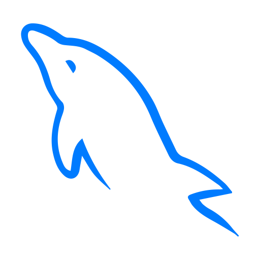

## Hey, I'm Lucas Emanuel :sweat_smile:	
Sou desenvolvedor Full Stack focado em soluções para a web, iniciando minha trajetória na faculdade em 2016, tendo grande familiaridade com PHP utilizando Laravel e Yii2 Framework, Git, SQL (MySQL), Modelagem de banco de dados e Vue.

Estou constante em busca de conhecimento e sempre preparado para novos desafios.

   

### Tecnologias :computer:

Faço uso das destas tecnologias para em meus projetos, _algumas são mais utilizadas do que outras_.

#### Tecnologias protagonistas

#### Tecnologias coadjuvantes

### Formação :mortar_board:
- Tecnologia em Sistemas para Internet - IFRN/CN.
### Overview :eyeglasses:	

